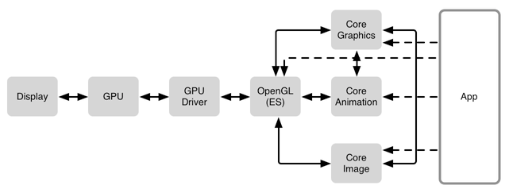

# 2.14 iOS图像的绘制

这篇文章真是看得人老泪纵横呀，内容朴实，我想技术人大多都是这样简单纯粹的人吧。

[金旭亮：一个普通IT人的十年回顾](http://blog.jobbole.com/12968/)

看到这里，想起昨天我的CC老师问我为什么要学英语，我竟无言以对，我说我喜欢学，她的笑容我很难形容，大概是我这个理由太少见吧。为什么一定要出国才考雅思，进外企才学英语，我就是愿意学，爱咋咋地。
拥有电脑成为作者的梦想，然而就在那个年代，父母竟然也给我们买了电脑，现在想想真的无法理解，让我拿出一年的收入买这样一个在当时看来没什么卵用的东西，然而，今年过年回家用年终奖的一部分，只是一部分，给老爸买了台笔记本，只有我的Mac一半的价钱，他都觉得是浪费，当然，他还是开心的像个孩子。

这里还有一本书，写的太好，以至于我都懒得吃晚饭了。真心希望我可以成为这样的幸存者。

[未来世界的幸存者](https://ruanyf.github.io/survivor/index.html)

## iOS图像的绘制

言归正传，研究这一块的起因是项目之前做的一系列关于app流畅滑动的优化，因为列表页加载的图片较多，所以优化起来很繁琐，最主要的工作是逆向了App Store的首页，并且针对每个优化点进行了深挖，当然，这些都是同事做的，我只是拿来学习Orz

#### AppStore圆角绘制

