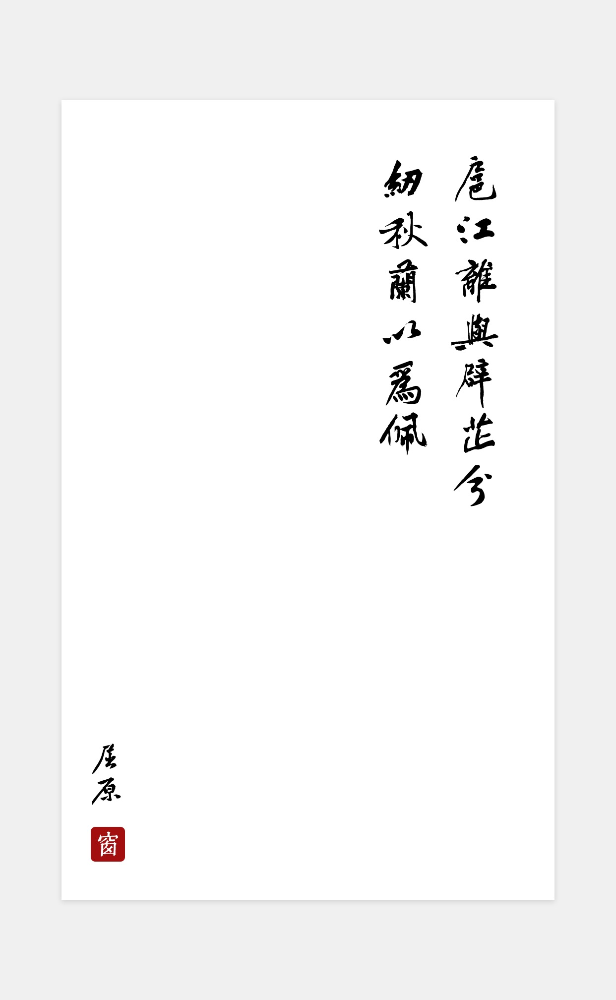

# 1.10

## 早起一杯浓鸡汤

[为猿七年有余，痒否？痛否？](http://mp.weixin.qq.com/s?__biz=MzA5MzY4NTQwMA==&mid=2650996524&idx=1&sn=1b3d08f87e9d580c4af5425678ace9c2&chksm=8bac4cdbbcdbc5cda9d98dacb317aad0a9a6ce01f3e30ba4626faadf18eb9e61a1f8540bef29&mpshare=1&scene=23&srcid=01103jnItc7lOWPLZOlEH1gp#rd)

## Git使用问题

[git pull error :error: remote ref is at but expected](http://stackoverflow.com/questions/11796580/git-pull-error-error-remote-ref-is-at-but-expected)

## 我对自己项目的理解

我们做的项目应该是我到目前为止见过的最特殊的项目了（也许是我孤陋寡闻才疏学浅）
首先，我们有不下10个开发者账号，恰巧好多都是我在维护，久而久之，对于应用上线发布的整个过程有了多次的实践经验。比如，创建使用开发与发布证书，创建AppId对应bundleId，创建不同的描述文件，针对不同的需求打开发包与Ad Hoc包，以及测试推送时配置的证书。
其次，我们的项目是不能真的上线App Store的，所以需要做很多处理，起初是通过在iTunes目录中写入文件读取的方式，后来通过JSPatch下发js热更新来实现，根本逻辑在于应用启动时通过一系列判断来确定是否加载。
应用切换后，由于我们的项目主要是用来下载应用的，所以涉及到下载与持久化存储的地方特别多，还有就是应用状态的切换。
最后，关于每次提审前的打包，我有无数的槽想要吐，以后还是吸取教训，提早测试为妙。

## 应用推荐——西窗烛

有事没事多读读古文，以后可以用来骗人。

[西窗烛-品味传统文化之美](https://itunes.apple.com/cn/app/xi-chuang-zhu-pin-wei-chuan/id912139104?mt=8)

