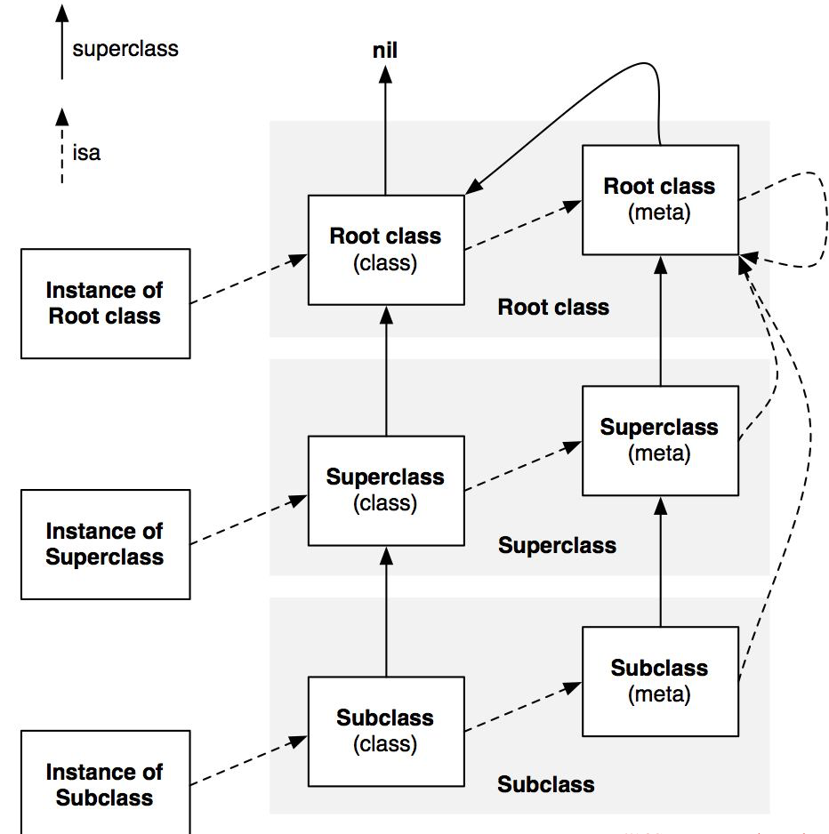

# 3.13面试题

[招聘一个靠谱的 iOS](http://blog.sunnyxx.com/2015/07/04/ios-interview/)

1. NSUserDefaults中可以存储NSDate吗，项目中使用偏好设置来做什么？  
	可以，自定义对象可以使用NSData存储，使用偏好设置保存用户信息。
	[API User​Defaults](https://developer.apple.com/reference/foundation/userdefaults)  
	[iOS/NSUserDefaults详解](http://www.jianshu.com/p/459c15cf6ce2)
2. NSObject类中有哪些常用的方法？
3. 自动释放池中的对象何时被释放？  
	在运行循环结束时释放。
	[自动释放池的前世今生 ---- 深入解析 autoreleasepool](http://draveness.me/autoreleasepool/)  
	[自动释放池](https://oflyme12.gitbooks.io/iosnote/content/autoreleasepool.html)  
	[OC内存管理那些事儿(3)：使用自动释放池块](http://matrixzk.github.io/blog/20141113/memory-management-3-autoreleasePool/)
4. nonatomic atomic  
5. hittest  
	[iOS hitTest-点击事件分发分析](http://www.hmttommy.com/2015/05/25/iOS-hitTest/)
6. 浅拷贝和深拷贝
	[iOS 集合的深复制与浅复制](https://www.zybuluo.com/MicroCai/note/50592)
	在非集合类对象中：对 immutable 对象进行 copy 操作，是指针复制，mutableCopy 操作时内容复制；对 mutable 对象进行 copy 和 mutableCopy 都是内容复制。用代码简单表示如下：
	
	[immutableObject copy] // 浅复制
	[immutableObject mutableCopy] //深复制
	[mutableObject copy] //深复制
	[mutableObject mutableCopy] //深复制

	在集合类对象中，对 immutable 对象进行 copy，是指针复制， mutableCopy 是内容复制；对 mutable 对象进行 copy 和 mutableCopy 都是内容复制。但是：集合对象的内容复制仅限于对象本身，对象元素仍然是指针复制。用代码简单表示如下：

	[immutableObject copy] // 浅复制
	[immutableObject mutableCopy] //单层深复制
	[mutableObject copy] //单层深复制
	[mutableObject mutableCopy] //单层深复制

7. synthesize
	
	

	[When should I use @synthesize explicitly?](http://stackoverflow.com/questions/19784454/when-should-i-use-synthesize-explicitly/19821816#19821816)

8. isa指针

