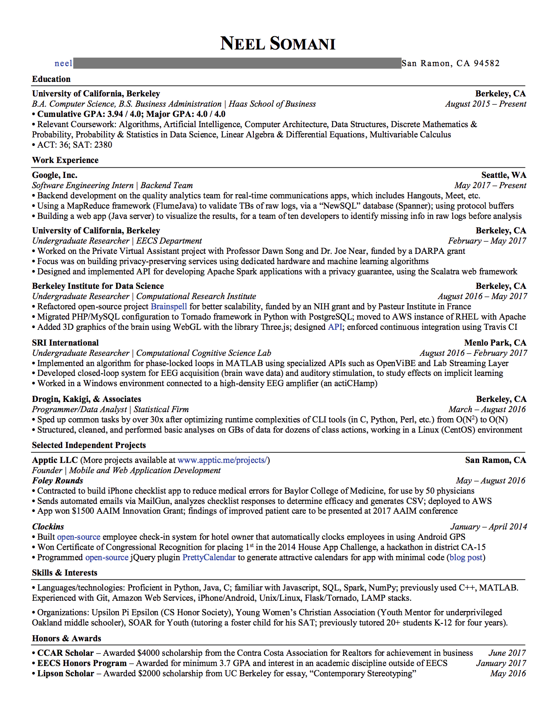

[TOC]

# 英文简历

多年来都一直有过想要写一份英文简历的冲动，鉴于没有迫切需要的一定不会做的懒癌晚期患者，一拖就拖了三四年，最近竟然会在无意间被谷歌的hr联系到让我去面试，顺便要求补一份英文简历，终于被逼无奈硬磨了出来。

先是看完了hr给我发的谷歌面试注意细节以及一些Youtube的视频，并无法做到思如泉涌，又通过搜索找到了一些英文简历格式模板、软件工程师的英文简历内容、英文简历注意事项等等，之后就是自己笨拙地写出了第一个版本的内容。然后就是一遍又一遍的修改，用了两天的时间提交了最终版本。

## 简历模板 

这里先放上我下载的所有模板：

链接:https://pan.baidu.com/s/1dYD-tLToeB7sd0RdMBgubg  密码:4d5d 
 
## 资料搜集

### 视频

#### [Create Your Resume for Google: Tips and Advice](https://www.youtube.com/watch?v=BYUy1yvjHxE)

这是Google的招聘官录制的视频，简短却内容丰富，按照他们的提示可以至少写出一份内容完备的简历，之后再不断调整就好。

##### 词汇

hackathon 编程马拉松

reverse chronological order 倒叙

##### 截图

#### [✨✨**这个视频最有用** Applying to Google: Technical Resume Tips with Google Recruiters](https://www.youtube.com/watch?v=ZjeXxLnnH5I)

##### 词汇

revamp 更新，修改

pertinent 有关的，相关的

not everybody is going to be a carbon copy of somebody else, not everybody leaves on a Friday to start somewhere else that very next Monday

上面这句的意思我觉得应该是：世界上没有两片相同的叶子

#### [Applying to Google: Resume Specifics—How to Show 'Project Work' on a Resume](https://www.youtube.com/watch?v=HcNr23p-92U)

#### [Basic Resume Creation for iPad Using Pages](https://www.youtube.com/watch?v=Ay-11w2uNFQ)

### 简历格式模板

在找格式模板的过程中，意外发现了一些设计简洁、优雅的付费类模板，鉴于目前没有这样的需求，并没有买，但还是把链接放在这里，以备不时之需：

[付费简历格式模板1](https://www.etsy.com/hk-en/shop/ResumeCoverPro1?ref=l2-shop-info-avatar&listing_id=669373625)

[付费简历格式模板2](https://www.etsy.com/hk-en/shop/MioDocs?ref=l2-shop-info-avatar&listing_id=601647368)

[付费简历格式模板3](https://www.etsy.com/hk-en/shop/DesignStudioTeti?ref=l2-shop-info-avatar&listing_id=681087177)

免费的模板如下：

[免费简历格式模板1](https://www.hloom.com/resumes/google-docs-templates/)

[免费简历格式模板2](https://business.tutsplus.com/tutorials/free-google-docs-microsoft-word-resume-templates-2018--cms-31276)

[免费简历格式模板3](https://www.jobscan.co/premium-resume-templates)

另外，还发现一些对撰写简历有帮助的网站，一并放上：

[zety - Resume Builder Online](https://zety.com/)

[resumegenius在线制作简历](https://resumegenius.com/)

[kickresume](https://blog.kickresume.com/)

### 软件工程师简历样例

首先找到的是这篇，里面有3-4个不同的简历样例，并且还分析了每种格式的优劣，以及针对不同人群适合的格式：

[iOS开发者简历样例](https://www.raywenderlich.com/2617-ios-developer-resume-examples)

在上面的文章中讲到了Resume和CV的区别，还附了如下的链接，简单来讲，CV就是更偏向于学术著作方面的，内容更加详细，具体的区别如下：

[Resume vs. CV](https://writingcenter.unc.edu/tips-and-tools/curricula-vitae-cvs-versus-resumes/)

接下来的这两篇文章提供了些许帮助：

[乔布简历推荐](https://cv.qiaobutang.com/lp/53bf61650cf20e542ffb3afc)

这份简历的内容中规中矩，大体上将重点都罗列清楚了，但是对我来讲可参考的价值不大，因为他的工作经验写的太笼统，我需要更为详细的借鉴。

[英文简历撰写指导](https://zhuanlan.zhihu.com/p/57783598)

主要是列出的一些动词和句子的格式，基本帮助我完成了初稿。

### 简历注意事项

[英文简历注意事项](https://www.zhihu.com/question/19856083)

## 简历撰写

### 撰写过程

我把每一步需要完成的内容都列了出来，不断细化，详细到每份工作的每个想要写的点，将这些排个序，逐个完成，硬是花了一下午的时间。

#### 名字和联系方式

中文名字中姓首字母大写，名首字母大写，其他小写，姓与名之间有一个空格，这里我没有放上我的英文名字，一是觉得不美观，二是觉得有些违和。

联系方式我纠结了很久是否要把地址写上去，因为非常担心格式有问题，毕竟国内外的地址还是有很大的不同的，最后我只写了城市、哪条路多少号和邮编，没有加区，也没写国家，因为有邮编应该就够了。另外就是邮箱和电话号，邮箱尽量用gmail的就好，用名字的拼音作为邮箱地址比较正式也方便一些。

#### 工作经验

工作经验的难点在于如何把中文翻译为英文，并且把重点都表示出来，这篇文章将常用的动词和句型都罗列了出来：

[就是这份简历! 帮他拿到了谷歌/FB/亚麻/微软/苹果等多个面试!](https://zhuanlan.zhihu.com/p/57783598)

#### 学历奖项

本来是想加一个leadership的分项的，但是实在没什么拿得出手的经历，都只是在校期间担任的一些小职务，所以干脆都写在学历奖项里了，比如班长团支书、优秀学生干部、各种奖学金等等的都可以参考下面的链接：

[英文简历技能证书撰写技巧汇总](http://cv.qiaobutang.com/knowledge/articles/52b165e10cf2af9850901e6e)

[如何在简历中写好教育背景](https://www.hjenglish.com/gerenjianli/p845659/)

[写英文简历，需要注意哪些问题？](https://www.zhihu.com/question/19856083/answer/49237689)

#### 技能证书

因为多年前的一个机缘巧合，我曾考过一次中级软件设计师，但是不会翻译，便找到了下面这篇博客：

[软考证书英文翻译](https://www.cnblogs.com/hadoopdev/p/3364555.html)

## 简历修改

### 修改前的准备

接下来开始大量的看一些英文简历需要注意的事项，以及iOS开发需要突出的重点内容，包括各种文章和视频，罗列如下：

#### 文章

##### [How to Craft a Winning Resume](https://www.glassdoor.com/blog/winning-resume/)

这篇文章措辞优美，非常适合全文背诵🤦‍♂️

###### 词汇

hype man 宣传人员，炒作人

well-crafted 精心制作的

coveted 梦寐以求的，令人垂涎的

tweak 微调

narrative 故事

`irresistible` talents 无法抗拒的；诱惑人的，具有非常的魅力的

garner 获得

it `scored` him offers from Google 获得胜利

seasoned 老练的

is `contingent` on their background 依情况而定的；取决于…的

starkly 完全，分明，赤裸地

deviate 脱离，越轨，违背，误入歧途

inherently 天性地，固有地

entrepreneurial 创业的，具有企业精神的

for a while 暂时

refrain 避免

executive 主管

quantitative 量化的，数量上的

metric 度量标准

concretely 具体地

compelling 引人注目的

elaborate 详细说明

###### 文章中涉及的简历

##### [This Is Exactly What Hiring Managers & Recruiters Look For When Scanning Resumes](https://www.glassdoor.com/blog/scanning-resumes/)

###### 词汇

> got the inside `scoop` from those who hold the key to your job future 

这个词在中英词典中的解释都不够准确，英英词典的解释是：information especially of immediate interest 类似内部信息的感觉

> top talent acquisition specialists

A talent acquisition specialist is an HR professional who specializes in sourcing, identifying and hiring specific types of employees.

decipher 解读

clutter up 扰乱，搅乱

articulate 清晰表达

complementary 补充的

##### [Recruiters Reveal 17 Keys to Scoring an Interview](https://www.glassdoor.com/blog/17-keys-to-scoring-an-interview/)

##### [The Dos and Don’ts of Resume Editing](https://www.glassdoor.com/blog/the-dos-and-donts-of-resume-editing/)

##### [How to Become the Candidate Recruiters Can’t Resist](https://www.glassdoor.com/blog/how-to-become-the-candidate-recruiters-cant-resist/)

##### [How to Write A Cover Letter](https://www.glassdoor.com/blog/guide/how-to-write-a-cover-letter/)

##### [10 Things You Need to Check Before Submitting Your Resume](https://www.glassdoor.com/blog/10-things-you-need-to-check-before-submitting-your-resume/)

##### [How to Get a Job](https://www.glassdoor.com/blog/guide/how-to-get-a-job/)

##### [How to Write a Resume](https://www.glassdoor.com/blog/guide/how-to-write-a-resume/)

##### [The Perfect Resume Looks Like This](https://www.glassdoor.com/blog/anatomy-perfect-resume/)

