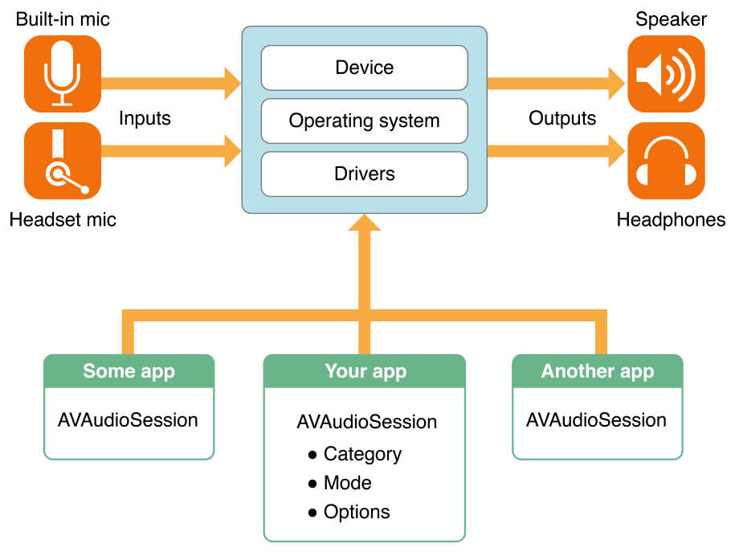
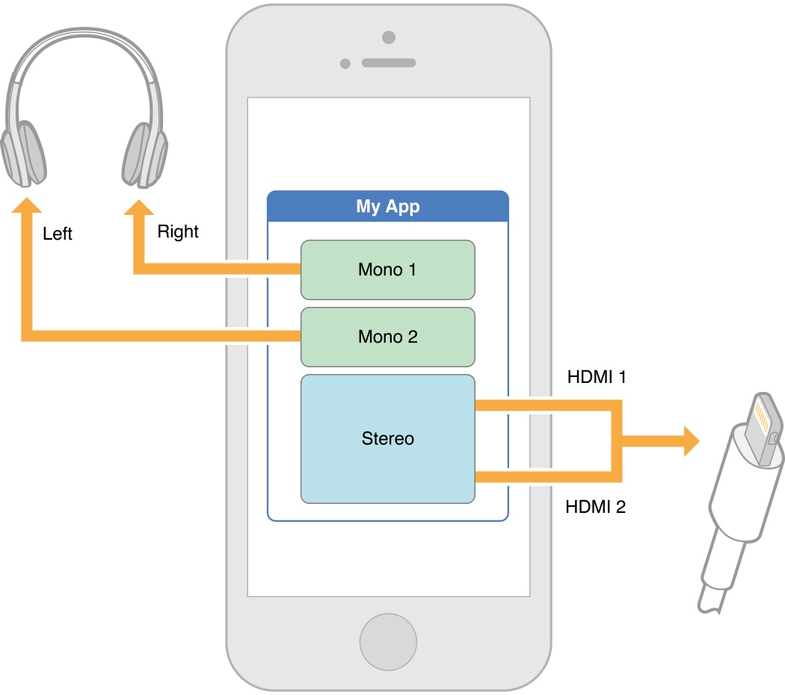
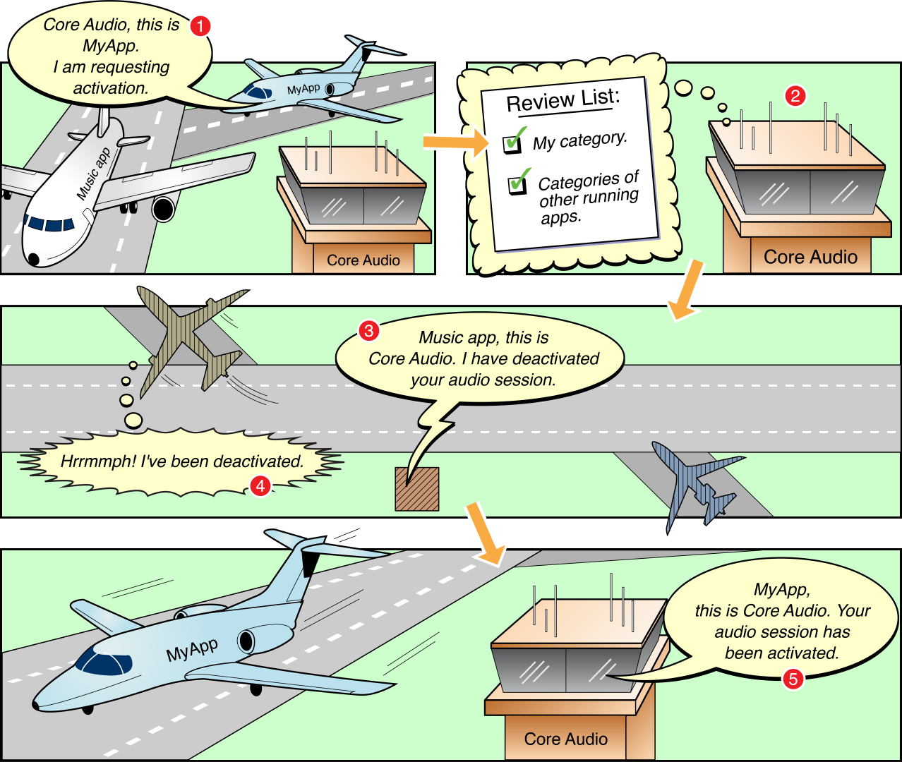

# Audio Session Programming Guide

该类是系统提供的一个单例类，供开发者用来与其他应用以及系统共同管理设备音频。

[文档](https://developer.apple.com/library/archive/documentation/Audio/Conceptual/AudioSessionProgrammingGuide/Introduction/Introduction.html)

https://developer.apple.com/library/archive/qa/qa1882/_index.html

[TOC]

## 简介

音频是在iOS，tvOS和watchOS系统中的一个管理服务。系统通过`audio sessions`的使用来管理应用间与应用内和设备级别的音频行为。

你可以使用`audio session`来与系统进行音频交互(你打算在应用内如何使用音频)。这个`audio session`作为应用与系统间的中介，进而充当底层音频硬件。你可以使用它与系统交互应用音频的性质，而不需要详细说明具体的行为或与音频硬件所需的交互。将这些细节的管理委派给音频会话确保了用户的音频体验的最佳管理。

### 目录一览

你可以使用`AVAudioSession`实例与你应用中的音频会话交互：

* 配置音频会话的类型`category`和模式`mode`来与系统交互以便告知你打算在你的应用中如何使用音频
* 激活你的应用音频会话以便将上述设置的类型`category`和模式`mode`配置激活
* 订阅并且响应重要的音频会话通知，例如音频中断和路径更改的通知
* 实现高级音频设备配置，例如设置采样率，I/O缓冲时间和频道数

#### 音频会话管理音频行为

一个音频会话是被用来配置你应用音频行为的作用于你应用与操作系统的中间件。当你的应用启动时，会自动获得一个单例音频会话，你可以配置它来提供需要的行为并且将其激活。

#### `Category`类型表示音频的角色

表示音频行为的主要机制是音频会话的类型。通过设置类型，你可以表明你应用是使用输入还是输出路径，你是否希望在你应用播放时还有其他音乐在持续播放，等等。你指定的这些行为需要满足交互设计中音频模块描述的用户所期望的内容。

AVFoundation定义了许多音频会话类别，以及一组复写和修饰符开关，允许您根据应用程序的个性或角色定制音频行为。各种类型支持回放、录音和录音回放。当系统知道应用程序的音频角色时，它为您提供了对硬件资源的适当访问。该系统还确保设备上的其他音频的工作方式，为您的应用程序，并符合用户的期望。

可以通过指定模式进一步定制某些类别，该模式用于对给定类别的行为进行专门化。例如，当应用程序使用视频录制模式时，系统可能会选择与使用默认模式时不同的内置麦克风。该系统还可以进行麦克风信号处理，对视频记录用例进行调整。

#### 通知支持中断处理

音频中断是应用程序音频会话的停用-它会立即停止您的音频。中断发生时，另一个竞争的应用程序的音频会话被激活，且该会话不是混响的。你的应用程序应该通过保存状态、更新用户界面等方式来响应中断。要在音频中断开始和结束时得到通知，请注册以观察AVAudioSessionInterruptionNotification类型的通知。

#### 通知支持音频路径更改的处理

当用户通过对接或卸载设备，或者通过插入或拔出耳机来启动音频路径更改时，他们有着特殊的期望。IOS人机界面准则描述了这些期望，并提供了如何满足它们的指导方针。通过注册以观察AVAudioSessionRouteChangeNotification类型的通知来处理路径更改。

#### 音频会话控制设备配置

应用程序不能直接控制设备硬件，但是音频会话为您提供了请求首选硬件设备设置的接口。此接口使您能够执行高级音频设备配置，如设置采样率、I/O缓冲持续时间和音频频道数。

#### 音频会话保护用户隐私

应用程序记录音频，单独或与视频一起，需要明确的用户许可，然后录音才被允许。在用户授予应用程序录制权限之前，应用程序只能静音录制。AVAudioSession提供了请求此权限和确定用户隐私设置的接口。

## 配置音频会话

音频会话类别是标识应用程序的一组音频行为的关键。通过设置一个类别，您可以向系统指示您的音频意图-例如，当Ringer/Silent开关被切换时，您的音频是否应该继续。几个音频会话类别，以及一组覆盖和修饰符开关，允许您自定义应用程序的音频行为。如表B-1所详细说明的，每个音频会话类别指定对下列每一种行为的一组特定响应：

* 非混音应用程序音频：如果是的话，当应用程序激活其音频会话时，不可混合应用程序就会被中断。
* 沉默开关：如果是的话，当用户激活沉默开关时，你的音频就会被静音。(在iPhone上，这个开关叫做环形/静音开关。)
* 支持音频输入：如果是，则允许应用程序音频输入(录音)。
* 支持音频输出：如果是，则允许应用程序音频输出(回放)。

大多数应用程序只需要在启动时设置一次该类别，但您可以根据需要随时更改该类别。您可以在音频会话处于活动状态时更改它；但是，通常最好在更改类别或其他会话属性之前禁用音频会话。在会话被停用时进行这些更改可以防止对音频系统进行不必要的重新配置。

### 音频会话默认行为

所有IOS、tvOS和WatOS应用程序都有一个默认音频会话，其预配置如下：
* 支持音频回放，但不允许录制音频。
* 在IOS中，将圆环/静音开关设置为静音模式可以使应用程序播放的任何音频都保持沉默。
* 在iOS中，当设备被锁定时，应用程序的音频就会被静音。
* 当你的应用程序播放音频时，任何其他背景音频-比如由音乐应用程序播放的音频-都会被静音。

默认音频会话具有有用的行为，但在大多数情况下，您应该定制它，以更好地满足您的应用程序的需要。要改变这种行为，您可以配置应用程序的音频会话。

### 配置音频会话

配置音频会话的主要方法是设置其类别。音频会话类别定义了一组音频行为。与每个类别相关的精确行为不是由应用程序控制的，而是由操作系统设置的。苹果可能会在操作系统的未来版本中细化类别行为，所以你最好的策略是选择最准确地描述你想要的音频行为意图的类别。音频会话类别和模式总结了每个类别的行为细节。

当类别设置应用程序的基本音频行为时，您可以通过设置类别的模式来进一步专门化这些行为。例如，VoiceoverIP(VoIP)应用程序将使用AVAudioSessionRecoryPlayAndRecord。您可以通过将音频会话的模式设置为AVAudioSessionModeVoiceChat来专门处理VoIP应用程序的此类行为。这种模式确保通过系统提供的信号处理对语音信号进行优化.

某些类别支持通过在会话中设置一个或多个类别选项来重写其默认行为(请参见AVAudioSessionCategoryOptions)。例如，当会话被激活时，与AVAudioSessionRecoryPlayback类别关联的默认行为会中断其他系统音频。在大多数情况下，播放应用程序需要这种行为。但是，如果希望您的音频与其他系统音频混合，可以通过在会话上设置AVAudioSessionRecoryOptionMixWithOthers选项来覆盖此行为。要设置音频会话类别(可选地设置其模式和选项)，请调用setCategory:mode:options:error:，如清单1-1所示。

### 使用多路由类别展开选项

多路由类别的工作方式与其他类别略有不同。所有其他类别都遵循“最后在WINS”规则，其中插入输入或输出路由的最后一个设备是主导设备。然而，多路由类别使应用程序能够使用所有连接的输出端口，而不仅仅是最后一个端口。例如，如果您正在通过HDMI输出路由收听音频并插入一组耳机，则您的应用程序继续通过HDMI输出路径播放音频，同时通过耳机播放音频。使用多路径类别，您的应用程序还可以发送不同的音频流到不同的输出路由。例如，应用程序可以向左耳机发送一个音频流，向右侧耳机发送另一个音频流，向HDMI路由发送第三个音频流。图1-1显示了向不同音频路由发送多个音频流的示例.

图1-1将不同音频流发送到不同的音频路由

根据设备和任何连接的附件，以下是有效的输出路由组合：
* USB和耳机
* HDMI和耳机
* 线和耳机

多路类别支持使用单个输入端口。

重要事项：内置扬声器只能在没有其他符合条件的输出端口(USB、HDMI、lineout)连接时才能使用。

### airplay的分类与模式选择

只有特定的类别和模式支持AirPlay。以下类别同时支持AirPlay的镜像版本和非镜像版本：AVAudioSessionRecorySoloAmbient AVAudioSessionRecoryAment AVAudioSessionRecoryback AVAudioSessionSessionRecord类别，以下模式只支持AirPlay的镜像版本：AVAudioSessionModeDefault AVAudioSessionModeVideoChat AVAudioSessionModeGameChat AVAudioSessionModeGameChat

注意：从IOS 10开始，通过使用AVAudioSessionRecoryPlayAndRecord选项激活会话，可以启用非镜像AirPlay输出。

### 启用后台音频

IOS和tvOS应用程序要求您为某些后台操作启用某些功能。播放应用程序所需的一个常见功能是支持后台播放。启用此功能后，当用户切换到另一个应用程序或锁定其iOS设备时，你的应用程序的音频可以继续播放。在IOS中启用高级播放功能(如AirPlay流和画中画)也需要此功能。配置这些功能的最简单方法是使用Xcode。在Xcode中选择应用程序的目标，然后选择Capability选项卡。在“功能”选项卡下，将背景模式切换到“ON”，并从可用模式列表中选择“Audio、AirPlay和Picture in Picture”选项。

在启用此后台模式并将您的音频会话配置为适当的类别后，您的应用程序就可以播放后台音频了。

## 激活音频会话

您已经通过设置音频会话的类别、选项和模式来配置它。要将您的配置付诸实施，您现在需要激活您的音频会话。

### 系统如何解决竞争的音频需求

随着应用程序的启动，内置的应用程序(消息、音乐、Safari、手机)可能会在后台运行。其中每一个都可能产生音频：一条短信到达，10分钟前开始的播客继续播放，以此类推。

如果你把一个设备想象成一个机场，应用程序表示为滑行飞机，那么这个系统就像一个控制塔。您的应用程序可以发出音频请求并说明其所需的优先级，但是对于“停机坪上”发生的事情的最终授权来自于系统。使用音频会话与“控制塔”进行通信。图2-1展示了一个典型的场景-当音乐应用程序已经在播放时，你的应用程序要求使用音频。在这种情况下，您的应用程序中断了音乐应用程序。

图2-1系统管理竞争的音频需求

在图的步骤1中，您的应用程序请求激活其音频会话。例如，在应用程序启动时，或者是在用户点击音频录制和播放应用程序中的Play按钮时，您会发出这样的请求。在步骤2中，系统考虑激活请求。具体来说，它考虑分配给音频会话的类别。在图2-1中，您的应用程序使用了一个类别，要求其他音频被静音.在步骤3和步骤4中，系统关闭了音乐应用程序的音频会话，停止了音频播放。最后，在第5步，系统激活您的应用程序的音频会话和回放可以开始。

### 激活和停用音频会话

虽然AVFoundation回放和记录类会自动激活您的音频会话，但是手动激活它可以让您有机会测试激活是否成功。但是，如果您的应用程序有播放/暂停 UI元素，请编写代码，以便用户必须在会话激活之前按Play。同样，当更改音频会话的活动/非活动状态时，请检查以确保调用成功。编写代码以优雅地处理系统拒绝激活会话的问题。

对于时钟、日历警报或来电，系统将禁用您的音频会话。当用户解除警报，或选择忽略电话时，系统允许您的会话再次活动。是否在中断结束时重新激活会话取决于应用程序类型，正如 [Audio Guidelines By App Type](https://developer.apple.com/library/archive/documentation/Audio/Conceptual/AudioSessionProgrammingGuide/AudioGuidelinesByAppType/AudioGuidelinesByAppType.html#//apple_ref/doc/uid/TP40007875-CH11-SW1) 所描述的那样。

要停用音频会话，请将false传递到setactive方法。

当使用AVFoundation对象(AVPlayer、AVAudioRecorder等)播放或录制音频时，系统负责在中断结束时重新激活音频会话。但是，如果注册通知消息并显式地重新激活音频会话，则可以验证重新激活是否成功，并更新应用程序的状态和用户界面。有关更多信息，请参见图3-1。

许多应用程序从来不需要显式地禁用它们的音频会话。重要的例外包括voip应用程序、逐转导航应用程序，以及在某些情况下，播放和录制应用程序。

确保VoIP应用程序的音频会话(通常在后台运行)仅在应用程序处理呼叫时处于活动状态。在后台，准备好接听电话，VoIP应用程序的音频会话不应该是活动的。

确保使用录制类别的应用程序的音频会话仅在录制时处于活动状态。在录制开始和停止之前，请确保您的会话是不活动的，以允许播放其他声音，例如传入的消息警报。如果应用程序支持背景音频播放或录制，如果应用程序没有主动使用音频(或准备使用音频)，则在进入后台时禁用其音频会话。这样做可以使系统释放音频资源，以便其他进程可以使用它们。它还防止应用程序的音频会话在应用程序进程被操作系统挂起时停用(参见AVAudioSessionInterruptionWasSuspendedKey)。

### 检查其他音频是否正在播放

当你的应用程序变得活跃，声音可能已经在设备上播放。例如，当用户启动应用程序时，音乐应用程序可能正在播放一首歌曲，或者Safari可能正在播放音频。如果你的应用程序是一个游戏，知道其他音频播放是特别重要的。许多游戏既有音乐音轨，也有音效。iOS人机界面指南中的音频建议您假设用户在玩游戏时希望其他音频以及游戏的声音效果继续进行。

在应用程序的代理方法DidBecomeActive：方法中，检查音频会话的secondaryAudioShouldBeSilencedHint属性，以确定音频是否已经在播放。当另一个具有不可混合音频会话的应用程序正在播放音频时，该值为真。应用程序应使用此属性作为一个提示，以沉默音频，这是次要的应用程序的功能。例如，使用AVAudioSessionCategoryAmbient的游戏可以使用此属性来确定是否应该静音，同时使其声音效果保持静音。您还可以订阅AVAudioSessionSilenceSecondaryAudioHintNotification类型的通知，以确保在可选的辅助音频静音应该开始或结束时通知应用程序。此通知仅发送给当前处于前台并具有活动音频会话的已注册侦听器。

此通知的userInfo字典包含AVAudioSessionSilenceSecondaryAudioHintTypeKey.的AVAudioSessionSilenceSecdaryAudioHintType值。使用音频提示类型确定您的辅助音频静音应该开始还是结束。

## 响应中断

添加音频会话代码来处理中断，确保您的应用程序在接到电话、时钟或日历警报响或另一个应用程序激活其音频会话时继续优雅地运行。音频中断是应用程序音频会话的停用-它会立即停止您的音频。中断发生时，一个竞争的音频会话从一个应用程序被激活，而该会话不被系统分类，以配合您的。会话不活动后，系统会发送一条“您被中断”的消息，您可以通过保存状态、更新用户界面等方式来响应该消息。您的应用程序可能会在中断后暂停。当用户接听电话时，就会发生这种情况。如果用户忽略一个呼叫，或者解除警报，系统就会发出一条“中断结束”的消息，您的应用程序就会继续运行。若要恢复音频，必须重新启动音频会话。

游戏类app音频建议：

* 建议使用以下category：AVAudioSessionCategoryAmbient、AVAudioSessionCategorySoloAmbient，当用户打开其他app或锁屏，游戏app应该停止播放声音，并且用户需要在玩游戏的同时可以听后台音乐。
* 当应用进入前台时，激活`audio session`
* 可以与其他app混响
* 若没有其他app播放后台声音时，游戏应用可以播放背景音乐
* 当焦点被归还时尝试重新激活声音
* 使用`secondaryAudioShouldBeSilencedHint`属性判断是否重新播放后台音乐
* 忽略音频输出途径的更改
* 在应用启动播放视频前，设置`category`

音视频app建议：

* 在前台时，当用户触发音视频播放时，激活`audio session`
* 在前台时，保持激活状态
* 若没有播放音视频并退到后台，就释放掉焦点
* 当被打断时，更新ui来表示音视频被暂停了，不要释放焦点
* 监听`AVAudioSessionInterruptionNotification`通知以便收到中断提醒，当中断结束，不要重新播放音视频，除非你的app优先于其他app
* 当被没有plug的设备切换音频输出路径，暂停播放，但不要释放焦点
* 若从挂起到前台时，处于未激活状态，当用户重新播放时，激活`audio session`
* 打开后台flag `UIBackgroundModes`
* 注册远程控制并且提供合适的媒体播放信息
* 使用`MPVolumeView`对象展示系统音量条
* 使用后台任务而不是静音流来保证应用被挂起
* 向用户请求录音权限`requestRecordPermission:`，不要依赖系统
* 需要录音时使用`AVAudioSessionCategoryPlayAndRecord`而不是`AVAudioSessionCategoryRecord`

AVAudioSessionSilenceSecondaryAudioHintNotification

AVAudioSessionInterruptionWasSuspendedKey

