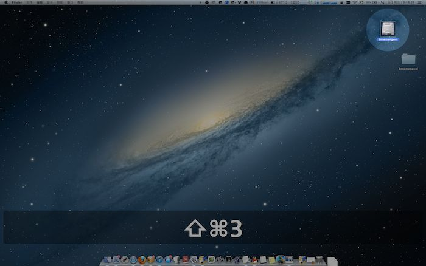

# 1.11代码签名总结

はじめまして

[TOC]

## 乃不知有汉，无论魏晋

今天在新加的日语群里跟一群小朋友聊天，学到一句十几年前背的桃花源记，乃不知有汉，无论魏晋。

## 关于代码签名的总结

在代码签名的学习中，对于开发者账号中的证书、App ID、设备、配置文件以及那个在Mac中生成的CSR文件的理解是混乱的，把这些的关系梳理清楚是很有必要的。

### 证书

每个开发者账号可以创建有限的开发与发布证书，证书，顾名思义就是授权给开发者可以发布应用的证明。

我们将创建好的证书安装在Mac上，这台电脑就被授权可以对应用进行打包。

### App ID

App ID就是工程中的bundle ID，是用来标识应用的，一个应用对应一个bundle ID，如果两个应用使用相同的bundle ID时，安装到设备上就会覆盖。

在创建App ID时，通常使用域名倒置加应用名称的方式，例如com.apple.health。

App ID中可以选择应用需要使用的功能，比如Notification(还需创建对应开发与发布的远程通知证书)、Purchase等。其中Game Center与In-App Purchase是默认支持的。

### 设备

这里添加进开发者账号中的设备是可以用来真机测试的，也就是安装开发包或ad Hoc包的时候可以使用的设备。

### 配置文件

配置文件页分为开发和发布两大类，在创建配置文件的时候，需要选择对应的证书、app ID、要使用的设备，至此，就将之前所有代码签名中的各个步骤集中起来了。

证书——开发者
app ID——应用
设备——需要安装以上开发者开发的上述应用的设备

当然，发布的配置文件是不需要选择设备的。

### CSR

CSR就是Certificate Signing Request，在创建证书时，需要先从证书颁发机构请求证书，使用CSR创建的证书只能在本机下载，其他电脑如果想要使用需要从这台电脑导出p12文件，我的理解是，从开发者账号中下载的证书只是公钥，想要私钥的话只能从上传过CSR的电脑中导出。

### 最后

在应用第一次进行真机测试的时候会弹出是否允许使用本机的签名，这里应该就是使用本机安装过的证书吧。

## 推荐的应用

### Mouseposé

Mac上一款演讲投影辅助工具`Mouseposé`，这是哪国语，我猜是法语吧。

常用的功能包括鼠标高亮与键盘按键显示。

看到这个软件首先想到了中学时期各科老师敲黑板以示重点的情景。

#### 安装

* 下载地址：
	[Mouseposé 3.2.7 鼠标高亮增强工具](http://xclient.info/s/mousepose.html)

* macOS sierra 10.12上无法打开keygen注册机的解决方法如下：
	[让CORE Keygen系列注册机成功运行在macOS sierra 10.12上的方法](http://xclient.info/a/a015de0d-acbd-a5c8-f5ca-bd78f6ae6bb4.html)

#### 使用

鼠标高亮默认的快捷键是F1，键盘按键显示的快捷键是F5。

这里鼠标高亮的目的是使观看者可以集中注意力并了解到演讲者的重点在哪里，单击鼠标会显示红色波纹，右键为绿色，其他是黄色，其他是什么情况我还没有发现，双击或多次点击则会有多个红色波纹散开，好可怕。

我下载它的目的在于这里，键盘按钮显示，可以在屏幕中下方显示出当前所按快捷键的组合。

