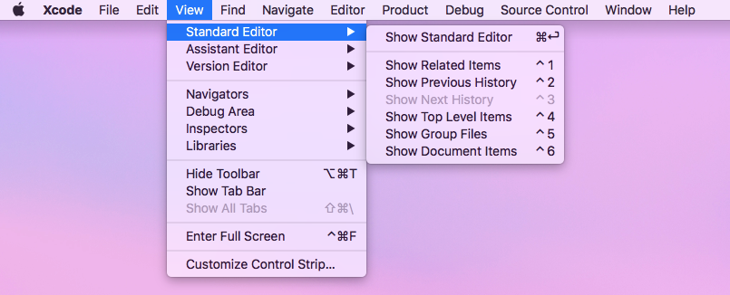
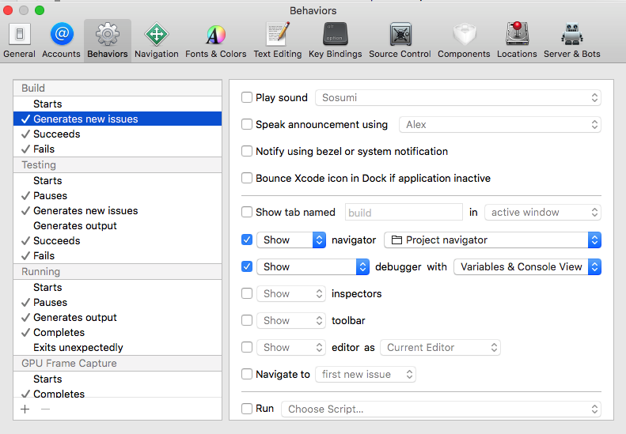

# WWDC12-402 Working Efficiently With Xcode

最近开始看以前的WWDC视频，发现讲的都是基础的内容，刚好适合查漏补缺，这个高效使用Xcdoe的视频介绍了一些常用的快捷键和可以自定义的调试行为。

## Xcode快捷键

快捷键主要介绍了部分搜索功能和工具栏的使用。

### 搜索

双击选中某个变量，点击 `cmd + e` 再依次点击 `cmd + g` 即可遍历当前文件中所有名称为该变量的位置

### 工具栏

`cmd + 0` 隐藏&显示左侧边栏，Xcode中该侧边栏的名称为 `Navigator`

`cmd + 1 、 cmd + 2 …… cmd + 9` 分别显示 `Navigator` 中从左至右的内容，对应如下：

* * *

`cmd + option + 0` 隐藏&显示右侧边栏，Xcode中该侧边栏的名称为 `Inspector`

`cmd + option + 1 、 cmd + option + 2` 分别显示 `Inspector` 中的两个内容，对应如下：

* * *

`ctrl + 1 、 ctrl + 2 …… ctrl + 6` 分别显示 `Standard Editor` 中的内容，如下图所示：

* * *

下图第二个被按下的按钮即为 `Standard Editor` ，往右依次为 `Assistant Editor` ， `Version Editor` ，而第一个按钮为 `Code Snippet` ，Xcode 10将其从右下方移至此处，快捷键为 `cmd + shift + l` ，若想删除，要先选中再点击 `shift + delete`

## Behavior

`Behavior` 的修改在偏好设置中，可以自定义一些调试行为，如下图所示的，在编译时显示导航中的工程目录，同时将控制台与断点调试时的变量一同显示出来。

## Other

视频中还介绍了一个使用 `Automator` 生成的 `workflow` ，这个之后有时间再看。

